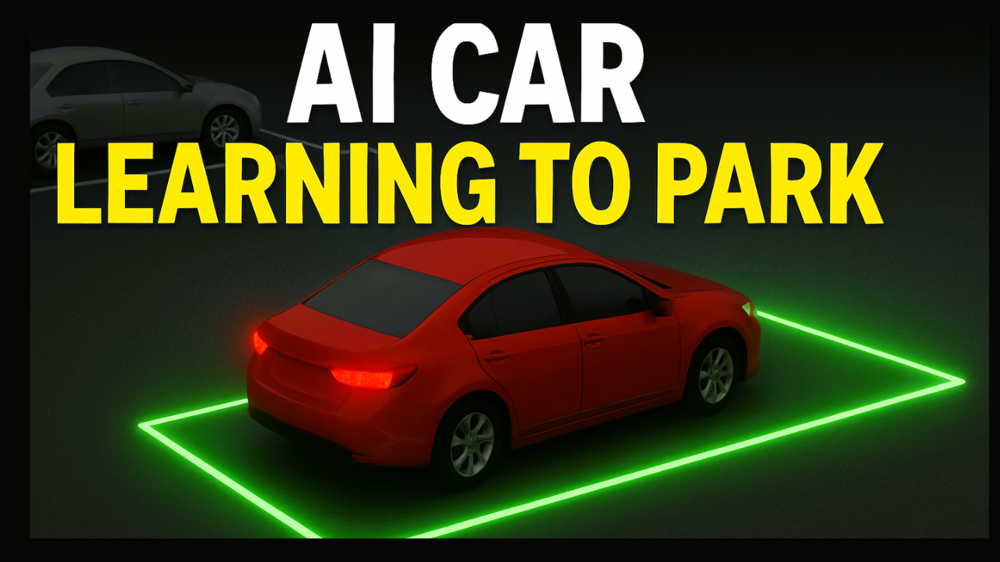

# ValetAgent: Parking Simulation with Unity ML-Agents

This project implements a smart parking simulation environment using Unity and ML-Agents, where an autonomous car agent learns to park in a target spot while avoiding obstacles and maximizing parking quality.

## Project Overview
The simulation consists of the following key components:

### 1. Car Agent (ML-Agents)
- **Uses**: Unity ML-Agents for reinforcement learning
- **Observes**:
  - Distance and angle to the parking target
  - Current speed (normalized)
  - Velocity alignment and angular velocity
- **Actions**:
  - Throttle control (gas/brake/off)
  - Steering control (left/right/center)
  - Handbrake
- **Rewards**:
  - Large positive reward for successful, well-aligned, and slow parking
  - Penalties for collisions with obstacles or curbs
  - Small penalties for inefficient steps and excessive angular velocity
  - Small rewards for progress and alignment

### 2. Car Controller (PROMETEO)
- **Realistic vehicle physics simulation**
- **Configurable parameters**:
  - Max speed (forward/reverse)
  - Acceleration, steering, brake force, drift behavior
- **Features**:
  - Wheel physics with friction curves
  - Drift mechanics
  - Optional particle and sound effects

### 3. Parking Environment
- **Dynamic obstacle placement**: Obstacles are placed next to the target spot, making the parking task more challenging and realistic
- **Randomized start and target**: Each episode randomizes the agent's spawn point and the target parking spot
- **Environment resets**: When the agent parks successfully or collides with an obstacle/curb

## Technical Details
- **ML-Agents Configuration**:
  - Discrete action space for throttle, steering, and handbrake
  - Observations are normalized for efficient learning
  - Supports both training and manual (heuristic) control
- **Physics Setup**:
  - Uses Unity's wheel collider system
  - Configurable center of mass for realistic car behavior
  - Rigidbody-based physics interactions

## Usage
1. Open the project in Unity (2020.3 or later recommended)
2. Assign the required prefabs and references in the CarAgent inspector
3. Train the agent using ML-Agents or control it manually with the keyboard

## Controls (Heuristic Mode)
- **W/S**: Gas/Brake
- **A/D**: Steer Left/Right
- **Space**: Handbrake

## Project Structure
- `Assets/CarAgent.cs`: ML-Agents agent implementation
- `Assets/ControlInterface.cs`: Car control abstraction
- `Assets/ParkingSpot.cs`: Parking spot logic
- `Assets/CarBody.cs`: Car body and collision logic
- `Assets/PROMETEO - Car Controller/`: Complete car physics implementation

## Challenges & Solutions
### Obstacle Placement Logic
**Challenge:** Ensuring obstacles are placed only next to the target spot, not filling the entire parking lot or blocking the target.

**Solution:**
- Implemented logic to identify the target spot and place obstacles only at adjacent spots, deactivating unused obstacle cars.

### Reward Shaping for Realistic Parking
**Challenge:** Designing a reward system that encourages not just reaching the target, but also proper alignment, low speed, and minimal angular velocity for realistic parking.

**Solution:**
- Added alignment, speed, and angular velocity checks at the goal, with significant bonuses for well-aligned, slow, and stable parking. Penalized misalignment, excessive speed, and collisions.

### Randomization and Generalization
**Challenge:** Preventing overfitting to specific spawn or target locations.

**Solution:**
- Randomized both the agent's spawn point and the target spot each episode. Obstacles are placed dynamically based on the current target.

### Efficient Obstacle Management
**Challenge:** Avoiding performance issues and visual clutter from too many obstacles.

**Solution:**
- Limited the number of obstacle cars instantiated and deactivated unused obstacles each episode.

## Dependencies
- Unity 2020.3 or later
- ML-Agents 2.0 or later
- PROMETEO Car Controller asset

## License
This project is for educational and research purposes. See LICENSE for details.

